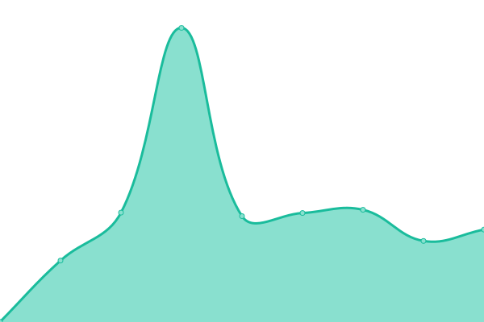
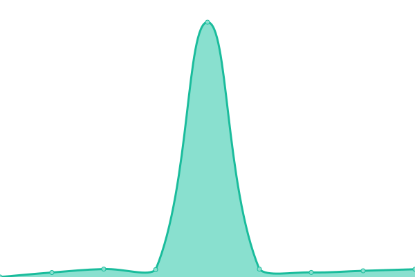
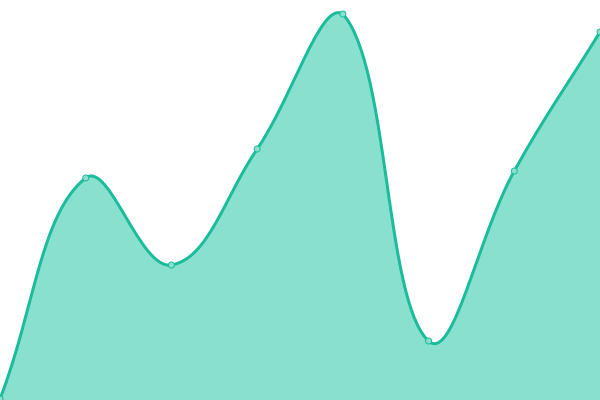

# [📈 Live Status](https://SeoWeb.github.io/upptime): <!--live status--> **🟧 Partial outage**

This repository contains the open-source uptime monitor and status page for [SeoWeb OÜ](https://www.seoweb.ee), powered by [Upptime](https://github.com/upptime/upptime).

With [Upptime](https://upptime.js.org), you can get your own unlimited and free uptime monitor and status page, powered entirely by a GitHub repository. We use [Issues](https://github.com/SeoWeb/upptime/issues) as incident reports, [Actions](https://github.com/SeoWeb/upptime/actions) as uptime monitors, and [Pages](https://SeoWeb.github.io/upptime) for the status page.

<!--start: status pages-->
<!-- This summary is generated by Upptime (https://github.com/upptime/upptime) -->
<!-- Do not edit this manually, your changes will be overwritten -->
<!-- prettier-ignore -->
| URL | Status | History | Response Time | Uptime |
| --- | ------ | ------- | ------------- | ------ |
|  [Puitline](https://puitline.ee) | 🟩 Up | [puitline.yml](https://github.com/SeoWeb/upptime/commits/HEAD/history/puitline.yml) | 

 1744ms
     
 | 

<a href="https://SeoWeb.github.io/upptime/history/puitline">100.00%</a>
    

|  [Unejutumaa](https://unejutumaa.ee) | 🟥 Down | [unejutumaa.yml](https://github.com/SeoWeb/upptime/commits/HEAD/history/unejutumaa.yml) | 

 1076ms
     
 | 

<a href="https://SeoWeb.github.io/upptime/history/unejutumaa">99.24%</a>
    

|  [Findly](https://findly.ee) | 🟥 Down | [findly.yml](https://github.com/SeoWeb/upptime/commits/HEAD/history/findly.yml) | 

 907ms
     
 | 

<a href="https://SeoWeb.github.io/upptime/history/findly">68.05%</a>
    

|  [Telli tünn](https://www.xn--tellitnn-c6a.ee) | 🟩 Up | [telli-tuenn.yml](https://github.com/SeoWeb/upptime/commits/HEAD/history/telli-tuenn.yml) | 

 1337ms
     
 | 

<a href="https://SeoWeb.github.io/upptime/history/telli-tuenn">100.00%</a>
    

|  [AI Toolas & News](https://ai-tools-and-news.com) | 🟥 Down | [ai-toolas-and-news.yml](https://github.com/SeoWeb/upptime/commits/HEAD/history/ai-toolas-and-news.yml) | 

 492ms
     
 | 

<a href="https://SeoWeb.github.io/upptime/history/ai-toolas-and-news">99.24%</a>
    

<!--end: status pages-->

[**Visit our status website →**](https://SeoWeb.github.io/upptime)

## 📄 License

- Powered by: [Upptime](https://github.com/upptime/upptime)
- Code: [MIT](./LICENSE) © [SeoWeb OÜ](https://www.seoweb.ee)
- Data in the `./history` directory: [Open Database License](https://opendatacommons.org/licenses/odbl/1-0/)
