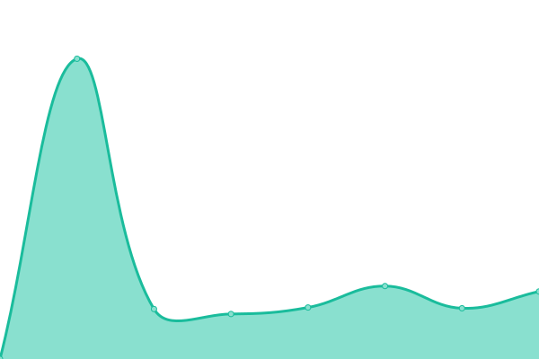

# [📈 Live Status](https://SeoWeb.github.io/upptime): <!--live status--> **🟩 All systems operational**

This repository contains the open-source uptime monitor and status page for [SeoWeb OÜ](https://www.seoweb.ee), powered by [Upptime](https://github.com/upptime/upptime).

With [Upptime](https://upptime.js.org), you can get your own unlimited and free uptime monitor and status page, powered entirely by a GitHub repository. We use [Issues](https://github.com/SeoWeb/upptime/issues) as incident reports, [Actions](https://github.com/SeoWeb/upptime/actions) as uptime monitors, and [Pages](https://SeoWeb.github.io/upptime) for the status page.

<!--start: status pages-->
<!-- This summary is generated by Upptime (https://github.com/upptime/upptime) -->
<!-- Do not edit this manually, your changes will be overwritten -->
<!-- prettier-ignore -->
| URL | Status | History | Response Time | Uptime |
| --- | ------ | ------- | ------------- | ------ |
|  [SeoWeb](https://seoweb.ee) | 🟩 Up | [seo-web.yml](https://github.com/SeoWeb/upptime/commits/HEAD/history/seo-web.yml) | 

 1212ms
     
 | 

<a href="https://SeoWeb.github.io/upptime/history/seo-web">100.00%</a>
    

|  [Dixid](https://dixid.eu/ee) | 🟩 Up | [dixid.yml](https://github.com/SeoWeb/upptime/commits/HEAD/history/dixid.yml) | 

 2545ms
     
 | 

<a href="https://SeoWeb.github.io/upptime/history/dixid">100.00%</a>
    

|  [Liselena](https://liselena.ee) | 🟩 Up | [liselena.yml](https://github.com/SeoWeb/upptime/commits/HEAD/history/liselena.yml) | 

 2432ms
     
 | 

<a href="https://SeoWeb.github.io/upptime/history/liselena">100.00%</a>
    

|  [SeoWeb Pages](https://sw-pages.eu) | 🟩 Up | [seo-web-pages.yml](https://github.com/SeoWeb/upptime/commits/HEAD/history/seo-web-pages.yml) | 

 350ms
     
 | 

<a href="https://SeoWeb.github.io/upptime/history/seo-web-pages">100.00%</a>
    

|  [Puitline](https://puitline.ee) | 🟩 Up | [puitline.yml](https://github.com/SeoWeb/upptime/commits/HEAD/history/puitline.yml) | 

 1188ms
     
 | 

<a href="https://SeoWeb.github.io/upptime/history/puitline">100.00%</a>
    

|  [Saunik](https://saunik.ee) | 🟩 Up | [saunik.yml](https://github.com/SeoWeb/upptime/commits/HEAD/history/saunik.yml) | 

 1082ms
     
 | 

<a href="https://SeoWeb.github.io/upptime/history/saunik">100.00%</a>
    

|  [Entro](https://entro.ee) | 🟩 Up | [entro.yml](https://github.com/SeoWeb/upptime/commits/HEAD/history/entro.yml) | 

 1056ms
     
 | 

<a href="https://SeoWeb.github.io/upptime/history/entro">100.00%</a>
    

|  [Unejutumaa](https://unejutumaa.ee) | 🟩 Up | [unejutumaa.yml](https://github.com/SeoWeb/upptime/commits/HEAD/history/unejutumaa.yml) | 

 297ms
     
 | 

<a href="https://SeoWeb.github.io/upptime/history/unejutumaa">100.00%</a>
    

|  [Findly](https://findly.ee) | 🟩 Up | [findly.yml](https://github.com/SeoWeb/upptime/commits/HEAD/history/findly.yml) | 

 371ms
     
 | 

<a href="https://SeoWeb.github.io/upptime/history/findly">100.00%</a>
    

|  [Momlife Store](https://momlife-store.com) | 🟩 Up | [momlife-store.yml](https://github.com/SeoWeb/upptime/commits/HEAD/history/momlife-store.yml) | 

 255ms
     
 | 

<a href="https://SeoWeb.github.io/upptime/history/momlife-store">100.00%</a>
    

<!--end: status pages-->

[**Visit our status website →**](https://SeoWeb.github.io/upptime)

## 📄 License

- Powered by: [Upptime](https://github.com/upptime/upptime)
- Code: [MIT](./LICENSE) © [SeoWeb OÜ](https://www.seoweb.ee)
- Data in the `./history` directory: [Open Database License](https://opendatacommons.org/licenses/odbl/1-0/)
